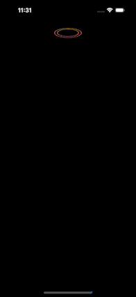
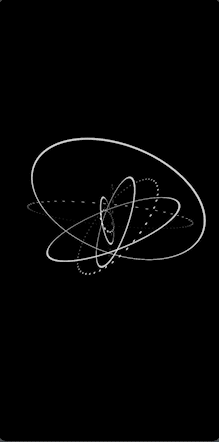
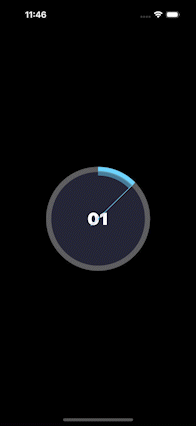

# Legendary Animo

Crafted micro-interactions and animation snippets for iOS using SwiftUI, UIKit, SpriteKit and Metal. Drop-in views you can reuse in your next app.

<p align="center">
  
  
  
</p>

---

## Highlights
- SwiftUI-first components (UIKit/SpriteKit where it shines)
- Ready-to-copy views with clean APIs
- 60 FPS-friendly, accessibility-conscious
- Examples include: rings, dots, fireworks, loaders, chips, orbits, buttons and more

## Table of Contents
- Overview
- Demos
- Quick Start
- Use in your project
- Add your own demo
- Credits

## Overview
Legendary Animo is a curated set of animation views. Open the app and tap any row to see a full-screen demo. Each demo is a self-contained `View` so you can copy the file or embed it directly.

## Demos (gallery)

<p align="center">
  
  
  
</p>
<p align="center">
  
  
  
</p>
<p align="center">
  
</p>

## Quick Start

```bash
# Xcode 15+ / iOS 16+
# Open the project
open legendary-Animo.xcodeproj
```

Run the app target. The home list shows all available demos grouped by month (latest first).

## Use in your project

Copy any view from `legendary-Animo/Animations/` into your app and present it like a regular SwiftUI view:

```swift
import SwiftUI

struct Example: View {
    var body: some View {
        RingsAnimationView()
            .frame(width: 200, height: 200)
            .preferredColorScheme(.dark)
    }
}
```

UIKit? SpriteKit? Some components expose wrappers, e.g. physics-based chips or the full-screen dot field scene. Each file is self-contained with sensible defaults.

## Add your own demo

1. Create a Swift file under `legendary-Animo/Animations/` and expose a `View` (e.g. `MyCoolView`).
2. Open `ContentView.swift` and add a `DemoItem` entry with title, emoji and destination:

```swift
DemoItem(
  row: RowView(icon: "✨", title: "My Cool View", desc: "Short description"),
  destination: AnyView(MyCoolView()),
  date: "May 20, 2025"
)
```

Your demo appears at the top automatically and routes correctly.

## Credits
Designed and built by Vishal Paliwal ([@iamvishal16](https://twitter.com/iamvishal16_ios)).

These are snippets of UI experiments and micro‑interactions using SwiftUI / UIKit / Metal. Questions or ideas? Drop a note at `paliwalvishal16@gmail.com`.

Want even more from me? Check this out: https://www.patreon.com/c/iamvishal16
