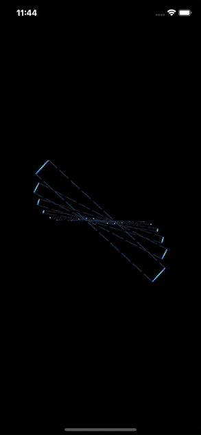

# legendary-Animo
Exploring SwiftUI animations with 3D, Linear, Fluid, gradient and other kind of animations. This animations that you can directly implement in your next iOS application or project.

# 3D Ring animation 

# Countdown Timer for Fitness

# Triangle Animation Scale

# MultiShapes 3D animation with rotation

# Dots Circle Animation in SwiftUI

# Google Photos Logo Animation in SwiftUI

# Rect Rotation animation in SwiftUI

# Battery Waves with Bubbles animation in SwiftUI

# 3D Cicles rotation using time sequence animation in SwiftUI

# Blinking Stars Animation in SwiftUI

